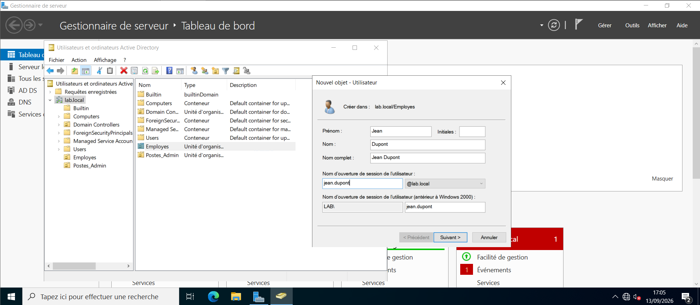
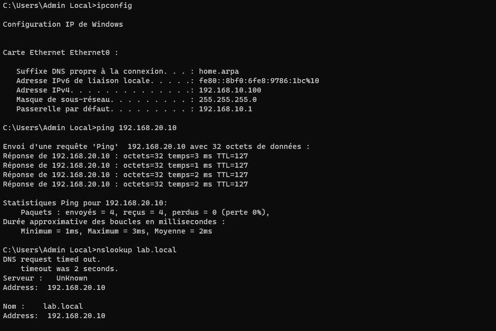
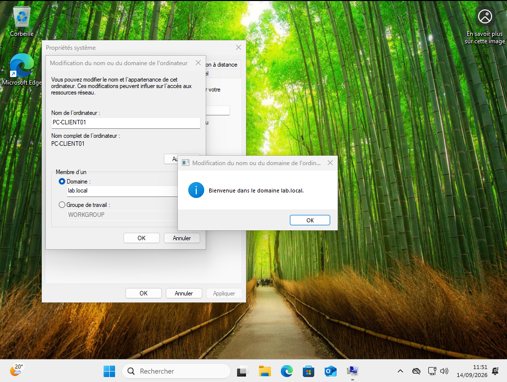
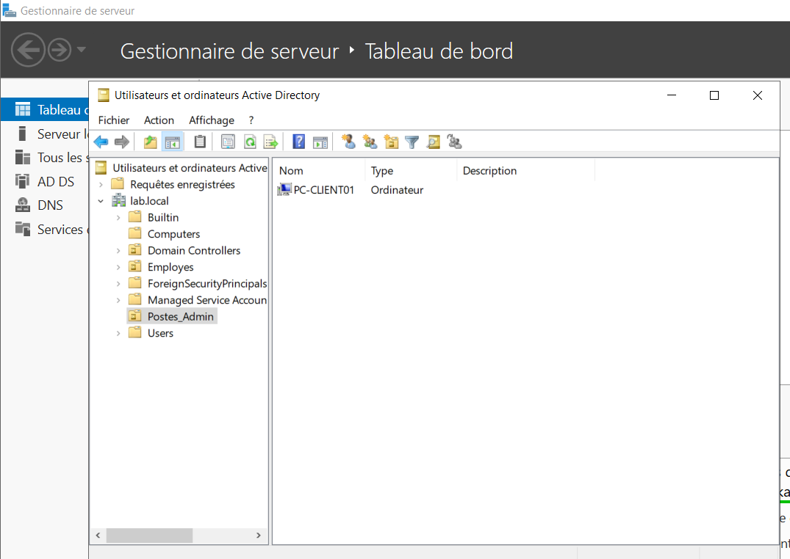
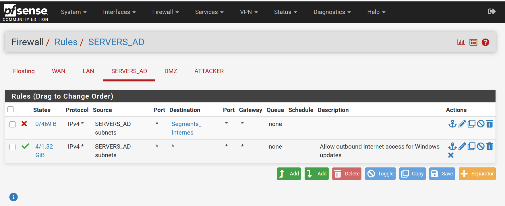
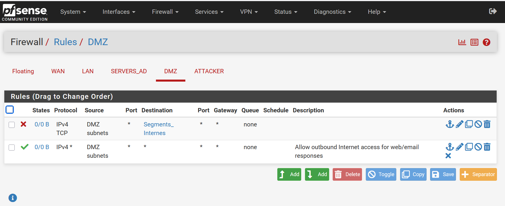
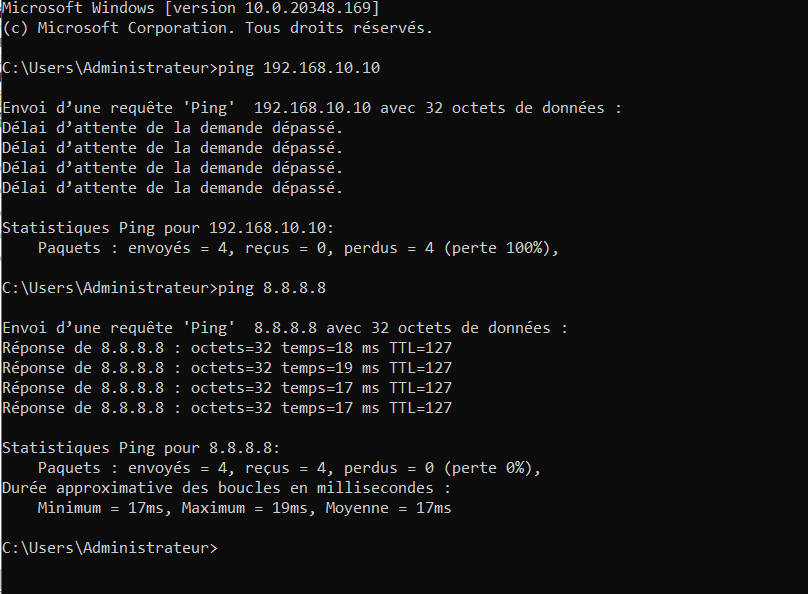

# Phase 2 - Active Directory et poste client

| | |
|---|---|
| **Projet** | SOC Lab Segmente - Reseau d'entreprise simule avec detection |
| **Statut** | Phase 2 terminee |
| **Outils utilises** | VMware Workstation Pro, Windows Server 2022, Windows 11 Pro |

## 1. Objectif de cette phase

Deployer un controleur de domaine Active Directory sur le segment SERVERS_AD, y creer une structure organisationnelle et des utilisateurs de test, puis integrer un poste client Windows 11 sur le segment LAN, joint au domaine. Cette phase transforme le squelette reseau de la Phase 1 en un environnement d'entreprise fonctionnel, avec de vrais comptes et une vraie authentification.

## 2. Infrastructure ajoutee

| VM | Role | OS | Segment | IP fixe | RAM |
|---|---|---|---|---|---|
| DC01 | Controleur de domaine | Windows Server 2022 | SERVERS_AD | 192.168.20.10/24 | 4 Go |
| PC-Client01 | Poste utilisateur | Windows 11 Pro | LAN | 192.168.10.100 (DHCP) | 3 Go |

Les deux VM sont stockees sur une cle USB externe (NTFS, USB 3.0) en raison de contraintes d'espace disque sur le disque interne du PC hote.

## 3. Structure Active Directory

Domaine cree : **lab.local** (foret et domaine niveau fonctionnel Windows Server 2016), avec DC01 comme premier controleur de domaine et serveur DNS integre.

### Unites d'organisation

| OU | Contenu |
|---|---|
| Employes | Comptes utilisateurs du domaine |
| Postes_Admin | Ordinateurs clients du domaine |

### Utilisateurs crees

| Utilisateur | UPN | OU |
|---|---|---|
| Jean Dupont | jean.dupont@lab.local | Employes |
| Marie Martin | marie.martin@lab.local | Employes |

*Assistant de creation d'utilisateur Active Directory, avec le nom d'ouverture de session au format UPN (jean.dupont@lab.local) et NetBIOS (LAB\\jean.dupont).*

## 4. Jonction du poste client au domaine

Le poste PC-Client01 recoit son IP via le DHCP de pfSense sur LAN (192.168.10.100), mais utilise un serveur DNS **manuel** pointant vers DC01 (192.168.20.10) : un client ne peut localiser un controleur de domaine que via un DNS qui connait la zone du domaine, ce que le DNS par defaut ne fournit pas.

*ipconfig confirme l'IP attribuee par DHCP, le ping vers DC01 reussit, et nslookup resout correctement lab.local vers 192.168.20.10.*

La jonction au domaine s'est faite via Parametres systeme (sysdm.cpl) > Modifier > Domaine, avec les identifiants du compte Administrateur du domaine.

*Message de bienvenue confirmant que PC-CLIENT01 a rejoint le domaine lab.local.*

Apres redemarrage, la connexion avec un compte utilisateur du domaine (jean.dupont) a ete verifiee avec succes.

*Le menu Demarrer confirme la session ouverte sous l'identite jean.dupont@lab.local, preuve que l'authentification via Active Directory fonctionne de bout en bout.*

## 5. Correction de l'ecart de pare-feu identifie en Phase 1

La documentation de la Phase 1 notait que les regles `SERVERS_AD -> any` et `DMZ -> any` autorisaient techniquement tout le trafic sortant, y compris vers les autres segments internes, ce qui contredisait la politique de segmentation voulue.

### Correction apportee

Un alias reseau **Segments_Internes** regroupant les 4 sous-reseaux du lab (192.168.10.0/24, 192.168.20.0/24, 192.168.30.0/24, 192.168.40.0/24) a ete cree dans Firewall > Aliases. Une regle de blocage a ete inseree **avant** la regle d'autorisation existante sur les onglets SERVERS_AD et DMZ, bloquant tout trafic vers cet alias tout en laissant passer le trafic vers Internet (la premiere regle qui correspond etant appliquee, l'ordre est essentiel).

*La regle de blocage vers Segments_Internes est placee avant la regle d'autorisation vers Internet.*

*Meme correction appliquee sur DMZ.*

### Validation

Depuis DC01, un ping vers un hote LAN (192.168.10.10) echoue desormais a 100 %, tandis qu'un ping vers Internet (8.8.8.8) reussit normalement - la preuve que SERVERS_AD est bien isole des autres segments internes tout en conservant sa sortie legitime.

*Ping bloque vers le LAN, ping reussi vers Internet : le comportement attendu est confirme.*

## 6. Incidents rencontres et resolus

### Promotion en controleur de domaine refusee

**Symptome :** l'assistant de promotion AD DS bloquait avec l'erreur "le compte d'administrateur local doit etre le compte d'administrateur de domaine lorsque vous creez un domaine".

**Cause :** la session etait ouverte avec un compte administrateur local classique (cree a l'installation), et non le compte **Administrateur** integre (RID 500), requis specifiquement pour promouvoir le tout premier controleur de domaine d'une nouvelle foret.

**Correction :** activation du compte integre via `net user Administrateur /active:yes`, definition d'un mot de passe, reconnexion sous ce compte, puis relance de l'assistant sans erreur.

### Absence de pilote reseau sur le poste client Windows 11

**Symptome :** a l'ecran de configuration initiale, la VM affichait "Reseau non identifie / Pas d'Internet" sans possibilite de continuer, meme apres avoir choisi le bon reseau virtuel VMware.

**Cause :** le type d'adaptateur reseau virtuel par defaut (vmxnet3) ne dispose pas de pilote natif dans Windows tant que VMware Tools n'est pas installe, ce qui cree une situation bloquante des l'installation initiale.

**Correction :** modification manuelle du fichier `.vmx` de la VM, remplacement de `ethernet0.virtualDev = "vmxnet3"` par `ethernet0.virtualDev = "e1000e"` (pilote natif Windows), redemarrage de la VM.

### Disque trop petit pour Windows 11

**Symptome :** message "Windows 11 ne peut pas etre installe sur ce lecteur" en cours d'installation.

**Cause :** le disque virtuel initial de 40 Go etait insuffisant (minimum reel constate : 52 Go).

**Correction :** agrandissement du disque virtuel a 60 Go via VM Settings > Hard Disk > Utilities > Expand (VM eteinte), sans reinstallation necessaire.

## 7. Contrainte materielle geree

Le disque interne du PC hote ne disposait que de 7 Go libres au moment de creer les VM. Une cle USB 3.0 de 64-128 Go, reformatee en NTFS, a ete utilisee comme emplacement de stockage pour les VM du lab (DC01 et PC-Client01), avec la precaution de toujours eteindre proprement les VM avant de debrancher la cle.

## 8. Prochaine etape - Phase 3

Mise en place de la stack de detection SOC : capture du trafic via le port mirroring de pfSense, installation de Suricata et/ou Wazuh, installation de Sysmon sur les machines Windows pour des journaux riches, et configuration des premieres alertes de base.
