# Phase 1 — Fondation réseau segmentée

| | |
|---|---|
| **Projet** | SOC Lab Segmenté — Réseau d'entreprise simulé avec détection |
| **Statut** | Phase 1 terminée |
| **Outils utilisés** | VMware Workstation Pro, pfSense CE 2.7.2 |

---

## 1. Objectif de cette phase

Construire les fondations réseau d'un lab simulant une petite entreprise segmentée en zones de confiance distinctes, avec un pare-feu central (pfSense) qui contrôle et filtre les échanges entre ces zones. Cette phase couvre uniquement l'infrastructure réseau — aucun service métier (Active Directory, serveur web, outils d'attaque) n'est encore installé, ce sera l'objet des phases suivantes.

## 2. Architecture réseau

Le réseau est découpé en 4 segments internes isolés, plus une sortie Internet, tous routés et filtrés par un unique firewall pfSense virtualisé.

| Segment | Rôle | Réseau IP | Passerelle (pfSense) |
|---|---|---|---|
| WAN | Sortie Internet (simulée via NAT VMware) | DHCP (192.168.17.0/24) | — |
| LAN | Postes utilisateurs / Administration | 192.168.10.0/24 | 192.168.10.1 |
| SERVERS_AD | Serveurs internes, futur contrôleur de domaine AD | 192.168.20.0/24 | 192.168.20.1 |
| DMZ | Services exposés (ex: serveur web) | 192.168.30.0/24 | 192.168.30.1 |
| ATTACKER | Poste d'attaque simulé (Kali, futur) | 192.168.40.0/24 | 192.168.40.1 |

Chaque segment correspond à un réseau VMware dédié (VMnet2 à VMnet5, en mode Host-only, DHCP VMware désactivé — c'est pfSense qui gère l'adressage), avec pfSense comme unique point de routage et de filtrage entre eux.

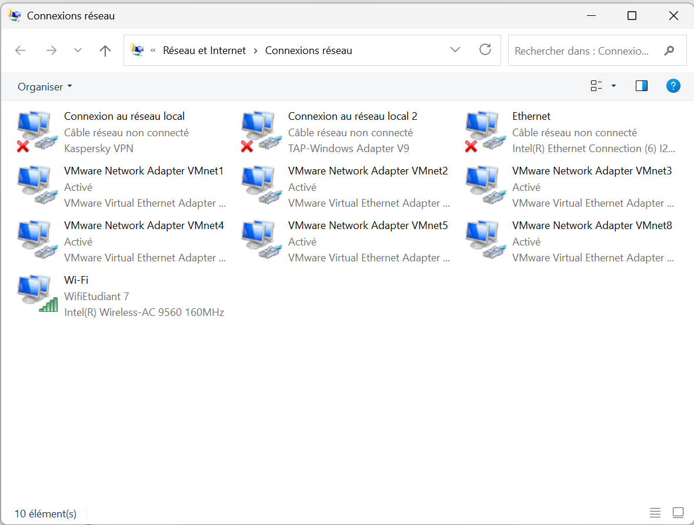
*Les réseaux VMnet2 à VMnet5 créés dans VMware, chacun dédié à un segment.*

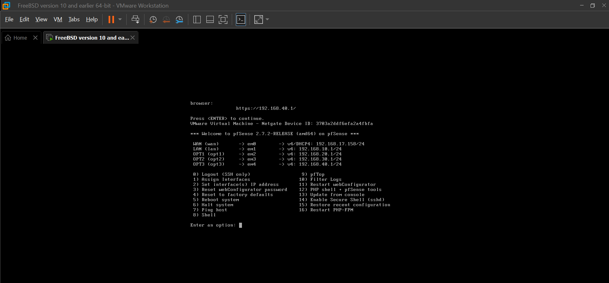
*Confirmation console des 5 interfaces assignées (WAN=em0, LAN=em1, OPT1=em2, OPT2=em3, OPT3=em4) avec leurs adresses IP.*

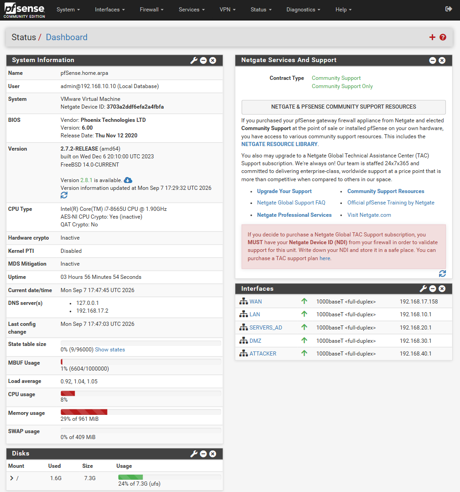
*Toutes les interfaces sont actives (flèche verte) avec les bonnes adresses IP, après renommage des interfaces OPT en noms explicites.*

## 3. Configuration DHCP

Le service DHCP de pfSense est activé sur les 4 interfaces internes, avec les plages suivantes :

| Interface | Plage DHCP | Adresses fixes réservées |
|---|---|---|
| LAN | 192.168.10.100 – 192.168.10.200 | 192.168.10.1 – 99 |
| SERVERS_AD | 192.168.20.100 – 192.168.20.200 | 192.168.20.1 – 99 |
| DMZ | 192.168.30.100 – 192.168.30.200 | 192.168.30.1 – 99 |
| ATTACKER | 192.168.40.100 – 192.168.40.200 | 192.168.40.1 – 99 |

Les futures machines serveurs (contrôleur AD, serveur web DMZ) recevront une IP **fixe** dans la plage réservée, hors DHCP — un serveur ne doit jamais dépendre d'une adresse qui peut changer.

## 4. Politique de pare-feu

### 4.1 Principe

pfSense filtre le trafic sur l'interface d'entrée. **Tout est bloqué par défaut**, sauf ce qui est explicitement autorisé — à l'exception de LAN, qui dispose d'une règle "allow all" créée automatiquement par l'assistant de configuration initial.

### 4.2 Politique cible (objectif final)

| Depuis \ Vers | Internet | SERVERS_AD | DMZ | ATTACKER |
|---|---|---|---|---|
| **LAN** | Autorisé | Autorisé | **Bloqué** | **Bloqué** |
| **SERVERS_AD** | Autorisé (limité) | — | Bloqué | Bloqué |
| **DMZ** | Autorisé (limité) | **Bloqué (volontaire)** | — | Bloqué |
| **ATTACKER** | Bloqué | Bloqué par défaut* | Bloqué par défaut* | — |

*Des règles ponctuelles et documentées seront ouvertes lors des scénarios d'attaque (Phase 4), puis retirées après chaque test.

**Point de conception le plus important :** DMZ → SERVERS_AD est bloqué intentionnellement. C'est la protection contre le scénario le plus classique d'une compromission réelle : un serveur exposé sur Internet (donc la cible la plus probable) qui, une fois piraté, ne doit **pas** pouvoir atteindre l'Active Directory interne en un seul rebond.

### 4.3 État actuel — ce qui est réellement en place

| Règle | Interface | Statut |
|---|---|---|
| Allow LAN to any (IPv4 + IPv6) | LAN | ✅ Créée (règle par défaut du wizard) |
| Allow SERVERS_AD → any | SERVERS_AD | ✅ Créée (sortie Internet pour MAJ Windows) |
| Allow DMZ → any | DMZ | ✅ Créée (sortie Internet pour réponses web/mail) |
| Aucune règle | ATTACKER | ✅ Conforme à l'objectif (isolation totale) |

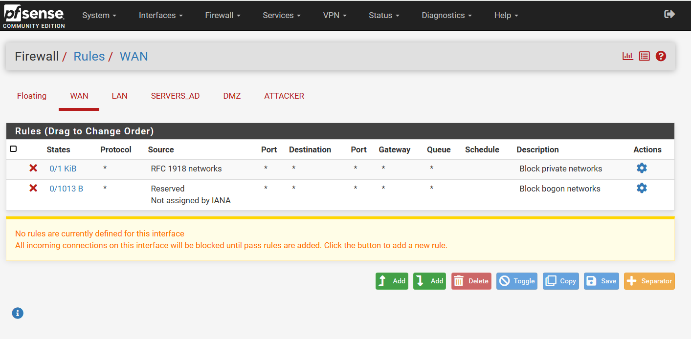
*Règles par défaut sur WAN : blocage des réseaux privés (RFC 1918) et des réseaux bogon non attribués par l'IANA. Aucune règle de passage définie = tout trafic entrant depuis Internet est bloqué par défaut, comme attendu pour une interface exposée.*

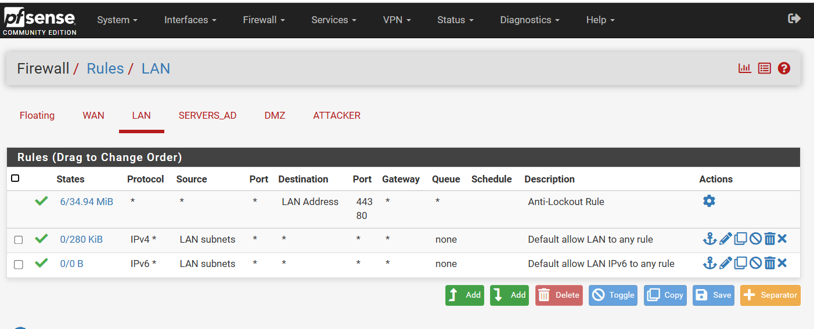
*Règle "Anti-Lockout" (protège l'accès à l'interface web même en cas d'erreur de configuration) et règle "allow LAN to any" créée par l'assistant initial.*

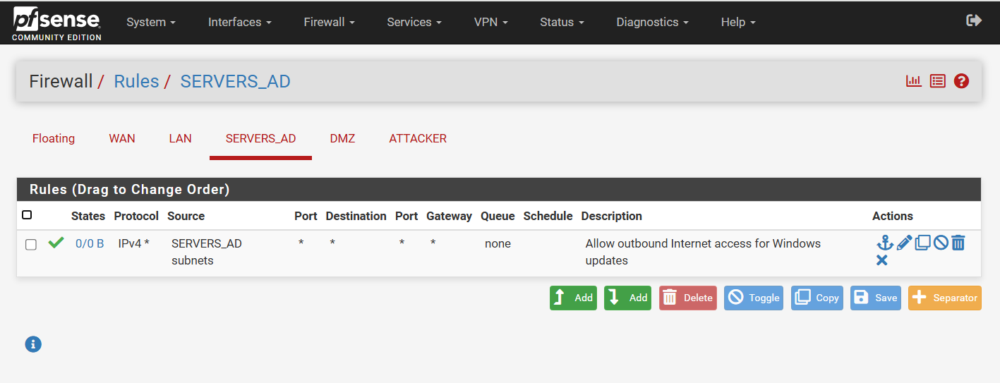
*Règle de sortie Internet pour les mises à jour Windows.*

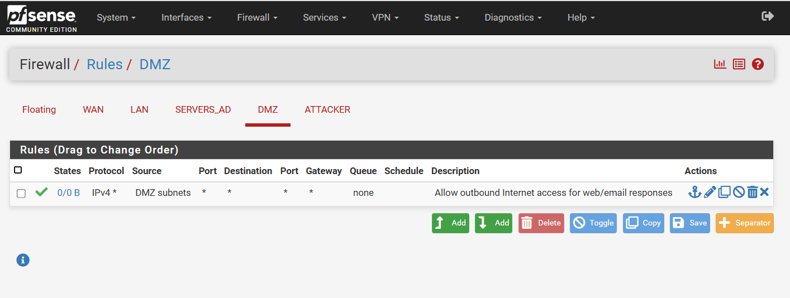
*Règle de sortie Internet pour les réponses web/mail.*

### 4.4 Écart connu à corriger en Phase 2

Les règles **SERVERS_AD → any** et **DMZ → any** créées en 4.3 autorisent techniquement **toutes** les destinations, pas seulement Internet — y compris LAN et les autres segments internes. Ça contredit la politique cible du tableau 4.2, qui prévoit de bloquer SERVERS_AD → LAN/DMZ et DMZ → SERVERS_AD/LAN.

**Action prévue :** remplacer la destination "any" de ces deux règles par un alias "WAN net" (ou ajouter des règles de blocage explicites placées *avant* la règle d'autorisation vers Internet, puisque pfSense applique la première règle qui correspond). Cette correction sera faite en Phase 2, une fois les machines serveurs installées, pour pouvoir tester chaque flux avec du vrai trafic plutôt qu'un simple ping.

C'est noté ici sciemment plutôt que corrigé en silence — documenter les limites connues d'une configuration fait partie d'une démarche de sécurité sérieuse.

## 5. Incident rencontré et résolu — étude de cas

### Symptôme
Ping de LAN (192.168.10.10) vers SERVERS_AD (192.168.20.1) : 100% de perte, alors que le ping vers la passerelle LAN (192.168.10.1) fonctionnait normalement.

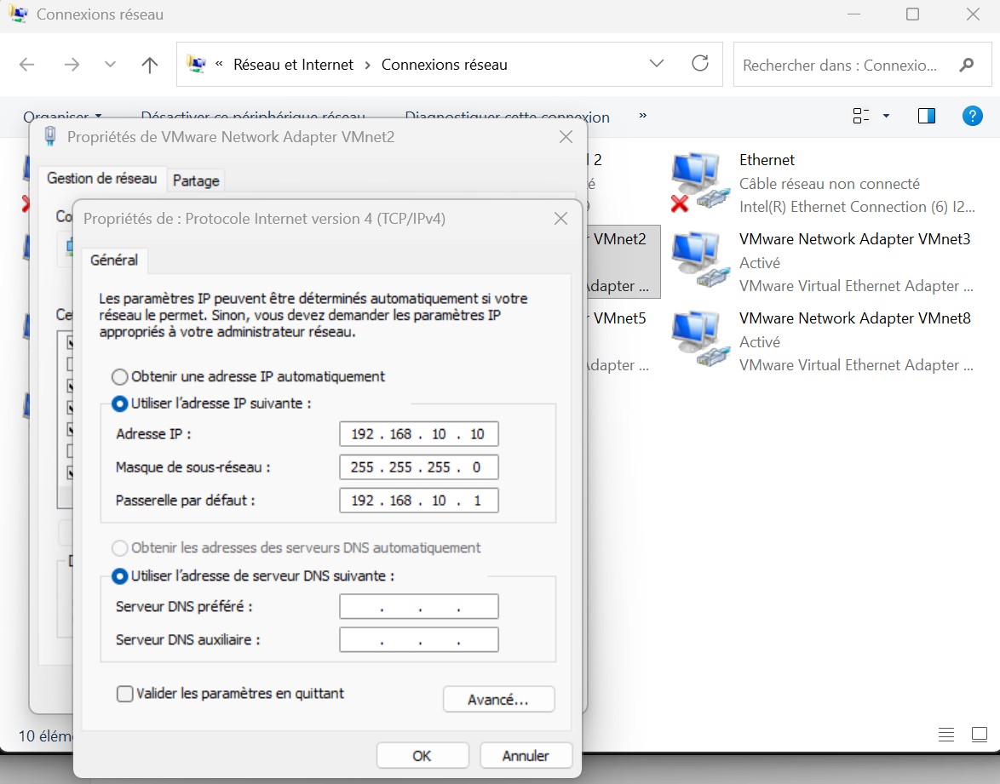
*IP fixe 192.168.10.10/24 configurée côté Windows pour pouvoir tester la connectivité vers pfSense.*

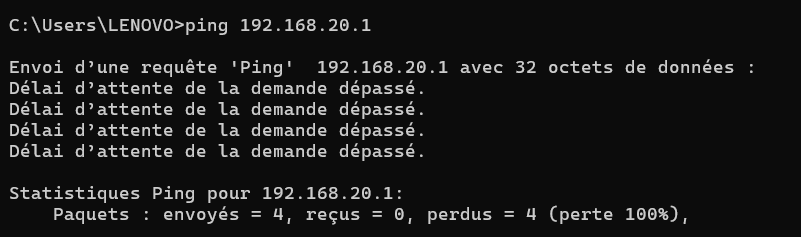
*Le ping vers la passerelle SERVERS_AD (192.168.20.1) échoue à 100%, alors que le réseau LAN local répond normalement.*

### Démarche de diagnostic
1. Vérification des règles de pare-feu LAN → conformes, rien d'anormal.
2. Vérification du mapping des interfaces physiques (Interfaces > Assignments) → conforme.
3. Test de ping initié depuis pfSense lui-même (Diagnostics > Ping, source SERVERS_AD) → échec également.

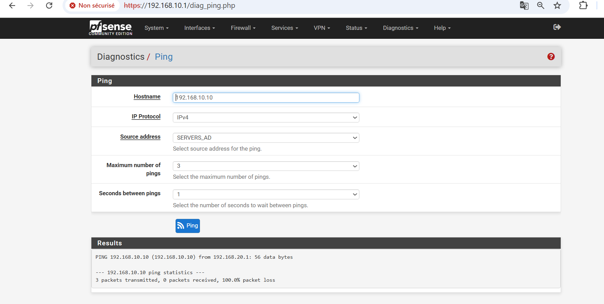
*Même pfSense, en pingant depuis sa propre interface SERVERS_AD vers l'hôte Windows, obtient 100% de perte — ce qui a réorienté le diagnostic.*

4. Consultation des logs de pare-feu (Status > System Logs > Firewall) → **aucune trace du paquet**, ni bloqué ni autorisé.
5. L'absence totale de log a réorienté le diagnostic vers la machine émettrice plutôt que vers pfSense.
6. `tracert 192.168.20.1` sur le PC Windows → révèle que le premier saut partait vers `10.188.0.1` (passerelle Wi-Fi), pas vers pfSense.
7. `route print` → confirme deux routes par défaut (0.0.0.0/0) simultanées : une via pfSense (métrique 291) et une via le Wi-Fi (métrique 55, prioritaire).

### Cause racine
Windows sélectionne toujours la route par défaut avec la métrique la plus basse. Le Wi-Fi (55) était systématiquement préféré à la route vers pfSense (291) pour toute destination sans route spécifique — ce qui incluait tous les sous-réseaux du lab.

### Correction
Ajout de 3 routes statiques persistantes sur le PC hôte, pointant explicitement les sous-réseaux du lab vers pfSense :

```
route -p add 192.168.20.0 mask 255.255.255.0 192.168.10.1
route -p add 192.168.30.0 mask 255.255.255.0 192.168.10.1
route -p add 192.168.40.0 mask 255.255.255.0 192.168.10.1
```

### Vérification
Les 3 segments répondent au ping (0% de perte), et `tracert` confirme un chemin direct en 1 saut via pfSense.

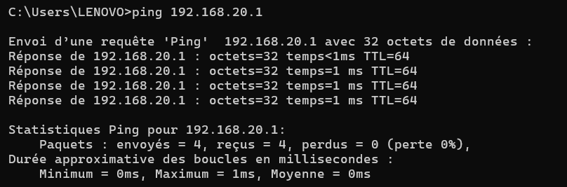
*Après ajout des routes statiques, le ping vers 192.168.20.1 répond normalement (0% de perte).*

### Nettoyage prévu en fin de projet
```
route delete 192.168.20.0
route delete 192.168.30.0
route delete 192.168.40.0
```

## 6. Sécurité de base appliquée

- Mot de passe administrateur pfSense changé dès le premier assistant de configuration (remplace la valeur par défaut `pfsense`).
- Interfaces internes (SERVERS_AD, DMZ, ATTACKER) vérifiées pour s'assurer que les options "Block private networks" / "Block bogon networks" restent réservées au WAN uniquement.
- Segment ATTACKER maintenu sans aucune règle de pare-feu — isolation totale par défaut, conforme au principe du moindre privilège.

## 7. Prochaine étape — Phase 2

Installation de Windows Server 2022 sur le segment SERVERS_AD, promotion en contrôleur de domaine Active Directory, correction de l'écart de règles identifié en 4.4, puis ajout d'une VM cliente Windows sur LAN jointe au domaine.
