# Phase 3 - Mise en place de la stack de detection SOC

## Objectif

Cette phase consiste a mettre en place les outils de detection et de supervision du lab :

- un SIEM (Wazuh) pour centraliser et analyser les evenements de securite
- un IDS reseau (Suricata) directement sur le pare-feu pfSense
- une collecte d'evenements avances sur les postes Windows (Sysmon) via des agents Wazuh

A la fin de cette phase, le lab dispose d'une vraie chaine de detection : trafic reseau et activite systeme sont observes, remontes et centralises dans un tableau de bord unique.

## Architecture mise en place

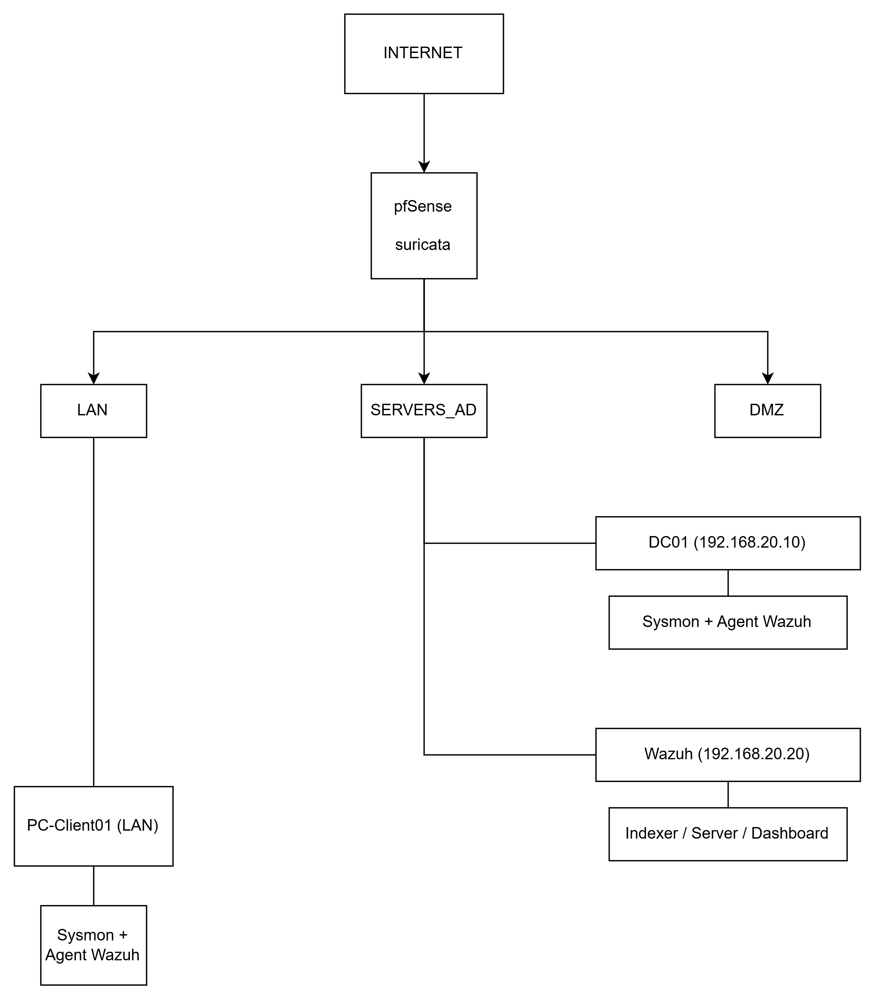

Choix d'architecture principaux :

- Suricata tourne directement sur pfSense (pas de VM dediee), il analyse le trafic qui traverse les interfaces du pare-feu.
- Wazuh est installe sur une VM Linux dediee (Ubuntu Server), separee de DC01, pour bien demontrer la separation entre controleur de domaine, plateforme de supervision, pare-feu et postes utilisateurs.
- Suricata remonte ses alertes vers Wazuh via un agent Wazuh installe sur pfSense lui-meme, qui lit le fichier `eve.json` genere par Suricata.
- Le port mirroring pfSense est laisse de cote pour cette phase : Suricata sur pfSense voit deja tout le trafic qui traverse le routage entre segments, ce qui suffit pour cette etape. Le mirroring pourra etre etudie plus tard pour les flux qui ne traversent pas pfSense (trafic intra-segment).

## Etapes realisees

### 1. Creation de la VM Wazuh

Avant de creer la VM, un etat des lieux des ressources disponibles a ete fait (RAM totale, RAM deja utilisee par DC01 et PC-Client01, coeurs CPU, espace disque libre sur la cle USB), pour dimensionner correctement la nouvelle VM sans saturer l'hote.

VM creee dans VMware Workstation :

- Systeme : Ubuntu Server (version LTS)
- Reseau : meme reseau host-only que DC01 (segment SERVERS_AD)
- RAM allouee : 4096 Mo
- Disque : 40 Go
- Adressage : IP statique 192.168.20.20, passerelle 192.168.20.1, DNS 192.168.20.10 (DC01)

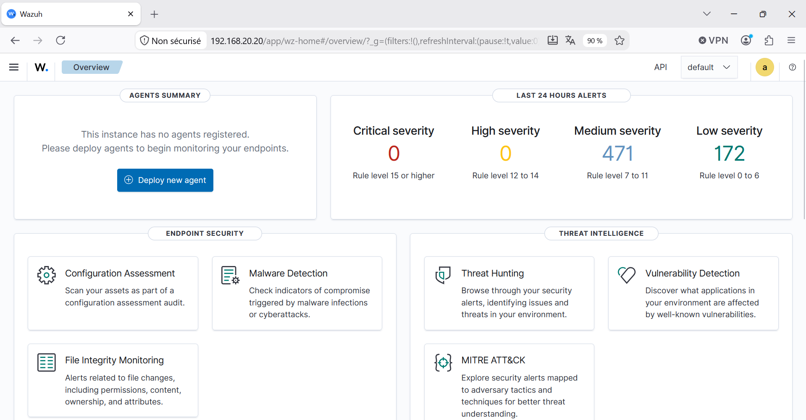

### 2. Installation de Wazuh (indexeur, serveur, dashboard)

L'installation officielle tout-en-un (`wazuh-install.sh -a`) a echoue a deux reprises, systematiquement au moment de l'installation du dashboard, avec une erreur `dpkg` (code de sortie 1). Le script nettoyait automatiquement l'installation partielle a chaque echec.

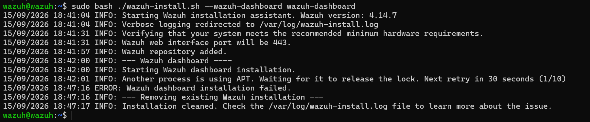

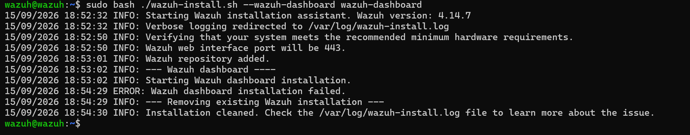

Apres analyse des journaux (`/var/log/wazuh-install.log` et `dmesg`), la cause reelle a ete identifiee : le disque de la VM etait plein. La partition racine geree par LVM n'utilisait que 19 Go sur les 40 Go du disque virtuel, le reste etant reste non alloue au groupe de volumes.

Correction appliquee, sans avoir besoin d'agrandir le disque virtuel lui-meme :

```
sudo lvextend -l +100%FREE /dev/mapper/ubuntu--vg-ubuntu--lv
sudo resize2fs /dev/mapper/ubuntu--vg-ubuntu--lv
```

Une fois l'espace disque disponible, l'installation a ete relancee composant par composant plutot qu'en mode tout-en-un (indexeur, puis cluster, puis serveur, puis dashboard), ce qui a permis d'isoler et de valider chaque etape independamment :

```
sudo bash ./wazuh-install.sh --wazuh-indexer wazuh-indexer
sudo bash ./wazuh-install.sh --start-cluster
sudo bash ./wazuh-install.sh --wazuh-server wazuh-server
sudo bash ./wazuh-install.sh --wazuh-dashboard wazuh-dashboard
```

L'installation du dashboard a alors reussi :

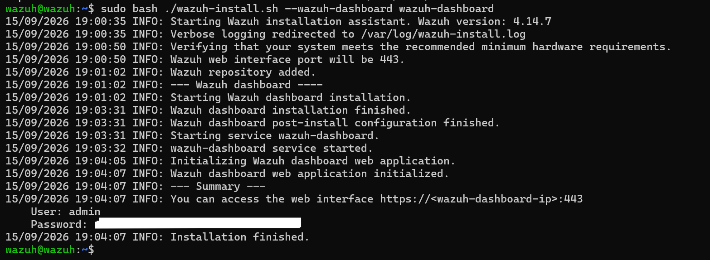

Un point de configuration reseau a egalement ete necessaire : la VM Wazuh utilise DC01 comme serveur DNS, or DC01 n'avait pas de redirecteur DNS configure vers Internet. Sans DC01 allumee et sans redirecteur, aucune resolution de nom n'etait possible depuis la VM Wazuh (ni depuis aucune autre machine du segment SERVERS_AD).

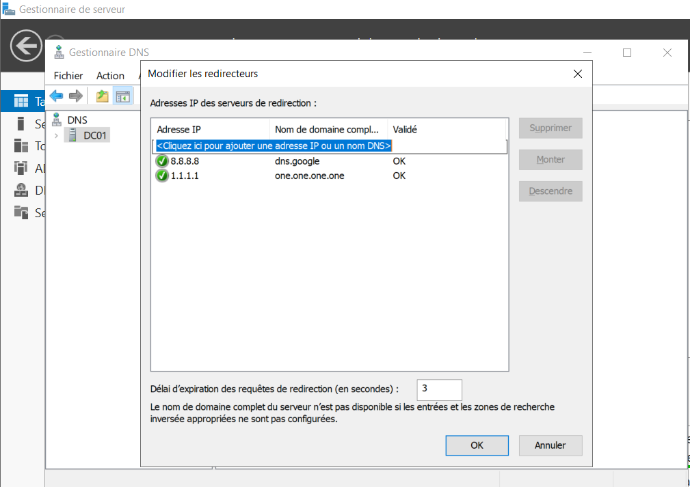

Le dashboard Wazuh est accessible depuis le navigateur du poste hote a l'adresse `https://192.168.20.20`.

### 3. Installation et configuration de Suricata sur pfSense

Suricata a ete installe comme paquet pfSense (System > Package Manager), puis configure sur deux interfaces :

- WAN : pour detecter les menaces provenant d'Internet
- SERVERS_AD : pour proteger specifiquement le segment le plus sensible du lab (controleur de domaine et plateforme de supervision)

Les regles ETOpen (Emerging Threats Open, jeu de regles gratuit et tres largement utilise) ont ete activees et mises a jour. Le mode de fonctionnement choisi est la detection seule (IDS), sans blocage automatique, pour ne pas risquer de se bloquer soi-meme pendant les tests.

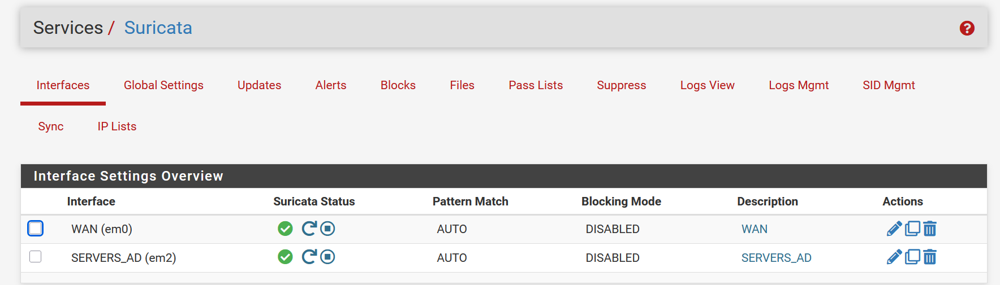

La detection a ete testee avec `curl http://testmyids.com`, une adresse specialement concue pour declencher une alerte IDS de test sans danger. Les alertes sont bien apparues dans l'interface native de pfSense :

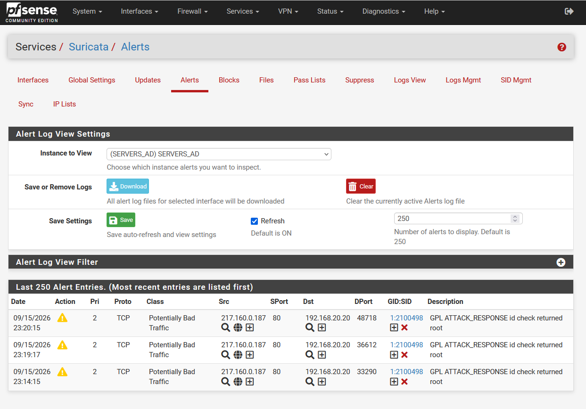

Un point technique a corriger a ce stade : pfSense a signale que le delestage materiel (hardware offloading : checksum, TCP segmentation, large receive) devait etre desactive pour que Suricata fonctionne correctement. Ce reglage se trouve dans System > Advanced > Networking.

### 4. Integration de Suricata dans Wazuh

Pour que les alertes Suricata remontent dans Wazuh, un agent Wazuh a ete installe directement sur pfSense (systeme FreeBSD). Le paquet a ete recupere via le depot officiel FreeBSD (active temporairement pour l'occasion, puis desactive ensuite, conformement aux bonnes pratiques de securite de pfSense).

```
mkdir -p /usr/local/etc/pkg/repos
echo 'FreeBSD: { enabled: yes }' > /usr/local/etc/pkg/repos/FreeBSD.conf
pkg update
env IGNORE_OSVERSION=yes pkg install wazuh-agent-4.14.7
```

L'agent a ensuite ete enregistre aupres du manager Wazuh et demarre :

```
/var/ossec/bin/agent-auth -m 192.168.20.20
service wazuh-agent enable
service wazuh-agent start
```

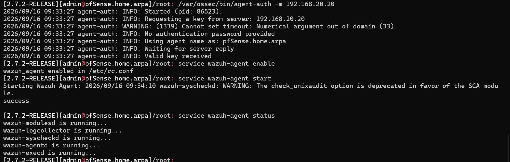

L'agent a ete configure pour lire le fichier `eve.json` genere par Suricata (format JSON, avec les alertes) :

```
<localfile>
  <log_format>json</log_format>
  <location>/var/log/suricata/*/eve.json</location>
</localfile>
```

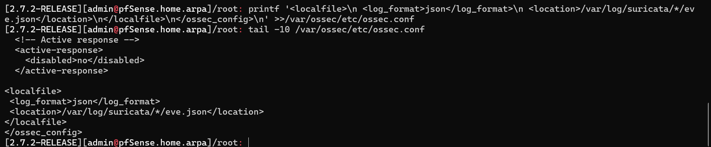

Il a fallu activer explicitement l'option "EVE JSON Log" dans les parametres de chaque interface Suricata (elle n'est pas active par defaut), avant de retrouver le fichier attendu sur le disque :

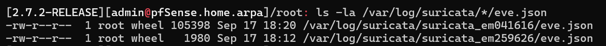

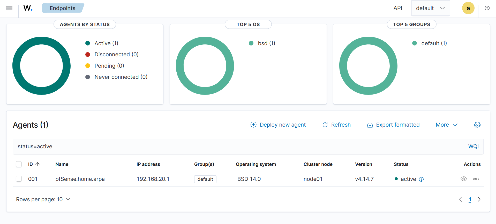

Une derniere etape a ete necessaire : par defaut, Wazuh sait decoder un journal JSON generique (extraction des champs), mais ne genere pas automatiquement d'alerte visible sans regle correspondante. Une regle locale a donc ete ajoutee sur le manager, dans `/var/ossec/etc/rules/local_rules.xml` :

```
<group name="suricata,">
  <rule id="100010" level="5">
    <decoded_as>json</decoded_as>
    <field name="event_type">alert</field>
    <description>Suricata alert: $(alert.signature)</description>
  </rule>
</group>
```

Apres redemarrage du manager, les alertes Suricata sont bien remontees dans le tableau de bord Wazuh, avec leur signature reelle :

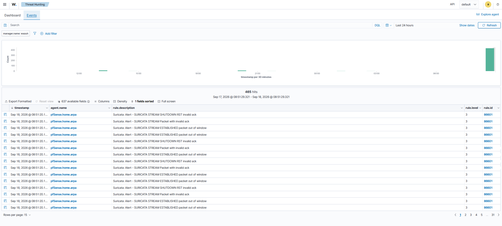

### 5. Installation de Sysmon et de l'agent Wazuh sur DC01

Sysmon (Sysinternals) a ete installe avec la configuration de reference SwiftOnSecurity, largement reconnue dans l'industrie pour une detection pertinente des le depart :

```
.\Sysmon64.exe -accepteula -i sysmonconfig.xml
```

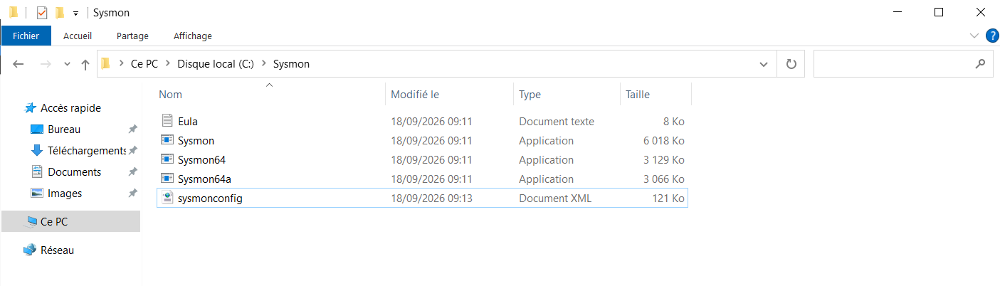

L'agent Wazuh pour Windows a ensuite ete installe et rattache au manager :

```
msiexec.exe /i wazuh-agent.msi /q WAZUH_MANAGER="192.168.20.20" WAZUH_AGENT_NAME="DC01" WAZUH_REGISTRATION_SERVER="192.168.20.20"
```

La lecture du journal Sysmon a ete ajoutee a la configuration de l'agent (canal `Microsoft-Windows-Sysmon/Operational`, format `eventchannel`). Aucune regle personnalisee n'a ete necessaire ici : Wazuh dispose deja d'un jeu de regles integre pour Sysmon et les journaux Windows, contrairement a l'integration Suricata.

Des les premieres minutes, des evenements detailles remontent dans le tableau de bord (activite PowerShell suspecte, reconnaissance/decouverte reseau, etc.) :

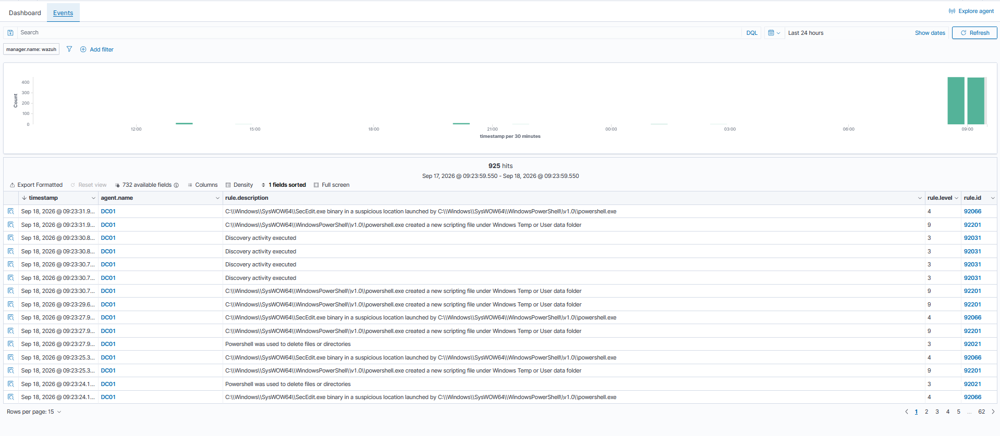

### 6. Installation de Sysmon et de l'agent Wazuh sur PC-Client01

La meme procedure a ete appliquee sur PC-Client01 (Sysmon avec la configuration SwiftOnSecurity, puis agent Wazuh avec surveillance du journal Sysmon). Les evenements remontent egalement correctement dans le tableau de bord :

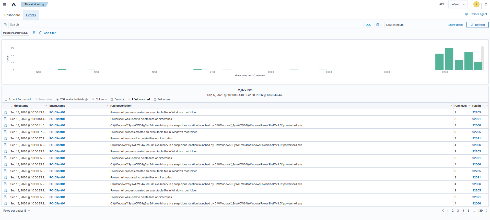

## Difficultes rencontrees et resolutions

| Difficulte | Cause | Resolution |
|---|---|---|
| Installation Wazuh tout-en-un en echec repete sur le dashboard | Bug connu de la version 4.14 sur l'installation combinee | Installation composant par composant |
| Echec de l'installation du dashboard (dpkg, code 1) | Disque de la VM Wazuh plein (partition LVM sous-dimensionnee) | Extension de la partition avec `lvextend` et `resize2fs` |
| Resolution DNS impossible depuis la VM Wazuh | DC01 (serveur DNS du domaine) sans redirecteur vers Internet, ou eteinte | Ajout de redirecteurs (8.8.8.8, 1.1.1.1) sur DC01 |
| wazuh-indexer plantait apres redemarrage du PC hote | Dossier `/var/log/wazuh-indexer` absent au demarrage, la JVM ne pouvait pas creer son fichier de log | Recreation du dossier avec les bons droits, et activation des services au demarrage (`systemctl enable`) |
| Aucune alerte Suricata visible dans Wazuh malgre une lecture correcte du fichier | Pas de regle de decodage associant les evenements JSON de type "alert" a une alerte Wazuh | Ajout d'une regle locale sur le manager |
| Alerte pfSense sur le delestage materiel | Hardware checksum offload / TSO / LRO actifs | Desactivation dans System > Advanced > Networking |

## Resultats

A l'issue de cette phase, le tableau de bord Wazuh centralise les evenements de trois sources distinctes : le pare-feu (Suricata), le controleur de domaine (DC01) et le poste client (PC-Client01).

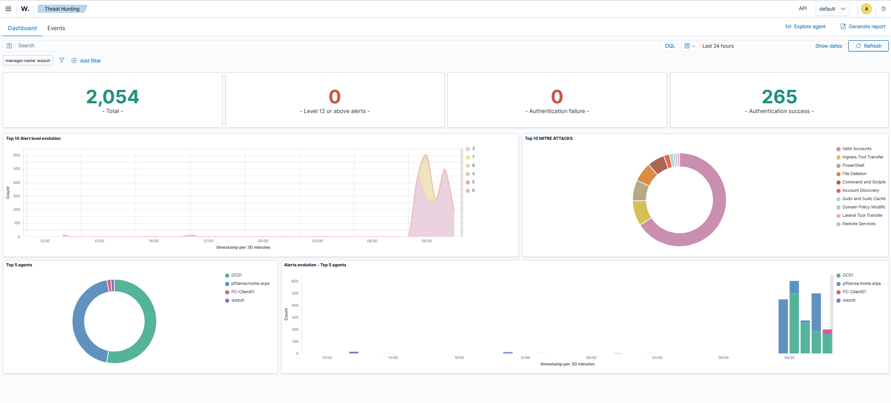

## Prochaine etape

Phase 4 : scenarios d'attaque et validation de la detection, a partir du segment ATTACKER (192.168.40.0/24) deja prepare sur pfSense depuis la Phase 1.
