# Phase 4 - Scenarios d'attaque et detection

## Objectif de la phase

Cette phase consiste a jouer plusieurs scenarios d'attaque realistes depuis une machine attaquante dediee (Kali Linux), placee sur le segment reseau isole ATTACKER, contre les autres segments du lab (SERVERS_AD et LAN). L'objectif est de verifier la capacite de detection de la stack de securite mise en place dans les phases precedentes (pfSense/Suricata pour la detection reseau, Wazuh pour la detection basee sur les logs hote), et d'identifier les forces et les limites de chaque couche de detection.

Quatre scenarios ont ete realises dans l'ordre :

1. Reconnaissance reseau (scan Nmap)
2. Attaque par force brute sur un compte de domaine
3. Mouvement lateral (comparaison compte standard contre compte administrateur)
4. Exfiltration de donnees

## Mise en place de la machine attaquante

Une VM Kali Linux (nommee `Kali-Attacker`) a ete creee sous VMware Workstation et rattachee au segment ATTACKER deja defini dans l'architecture du lab (Phase 1), sur le VMnet correspondant a l'interface OPT3 de pfSense.

Configuration reseau retenue :

- Adresse IP : `192.168.40.10/24`
- Passerelle : `192.168.40.1` (pfSense, interface ATTACKER)
- Systeme : Kali Linux (environnement Xfce), disque virtuel de 26 Go

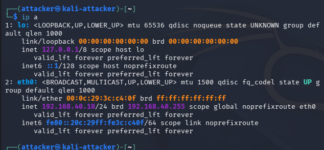

Une regle de pare-feu a ete ajoutee sur pfSense, sur l'interface ATTACKER, pour autoriser le trafic sortant de ce segment vers les autres segments du lab (Action : Pass, Protocole : any, Source : ATTACKER net, Destination : any). Sans cette regle, tout le trafic issu de Kali est bloque par defaut par pfSense, aucun scenario n'aurait ete possible.

Les outils suivants ont ete installes ou verifies sur Kali : `nmap`, `netexec` (successeur de `crackmapexec`, utilise a la place de `hydra` car le module SMB de Hydra ne supporte pas SMB2/3, protocole utilise par Windows Server 2022 par defaut).

## Vue d'ensemble de la detection sur la journee

Le tableau de bord Wazuh, sur une fenetre de 24 heures couvrant l'ensemble des scenarios, donne une vision globale de l'activite detectee sur les agents du lab (DC01, PC-Client01, pfSense, Wazuh).

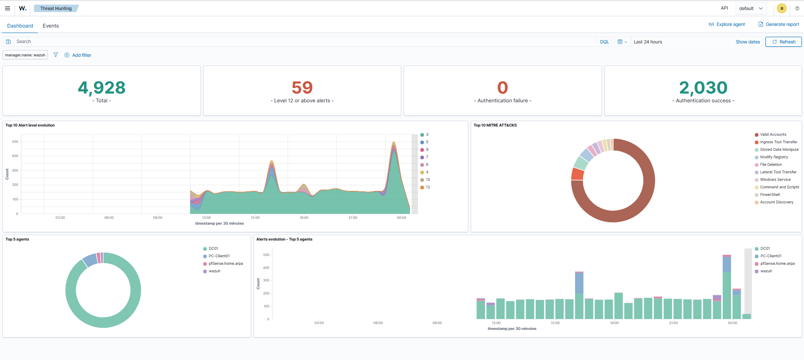

## Scenario 1 - Reconnaissance reseau (Nmap)

### Objectif

Depuis Kali-Attacker, decouvrir les hotes actifs sur les segments SERVERS_AD et LAN, puis realiser un scan de ports complet avec detection de version et scripts par defaut sur les cibles identifiees (DC01 et PC-Client01), afin de verifier la detection de cette activite par Suricata et Wazuh.

### Deroulement de l'attaque

Un premier scan de decouverte (ping scan) a ete lance sur le sous-reseau SERVERS_AD, revelant trois hotes actifs : la passerelle pfSense (192.168.20.1), DC01 (192.168.20.10) et un troisieme hote inattendu (192.168.20.20).

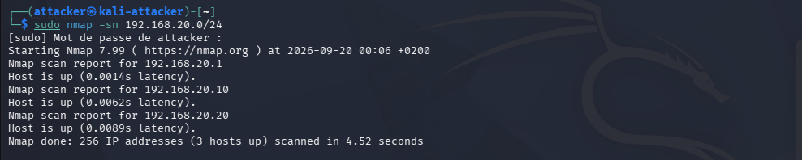

Un scan de ports complet (`-Pn -sV -sC -p-`) a ensuite ete realise sur DC01. Les resultats confirment le role de controleur de domaine : ports Kerberos (88), LDAP (389, 3268), SMB (445), avec le domaine `lab.local` identifie, et le SMB signing actif et obligatoire (bonne pratique deja en place).

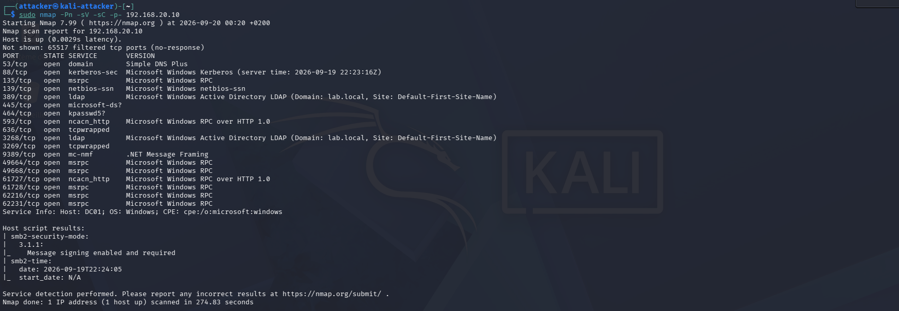

Le meme type de scan a ete realise sur PC-Client01, avec beaucoup moins de ports ouverts (135, 5040, 7680), coherent avec un poste client Windows protege par son pare-feu local.

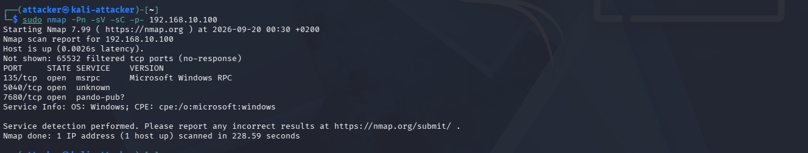

L'hote inattendu (192.168.20.20) a ete identifie par un scan de version cible : il s'agit en realite de la VM Wazuh elle-meme (port 22 SSH et port 443 avec un en-tete `osd-name: wazuh`), un hote legitime du lab et non une intrusion.

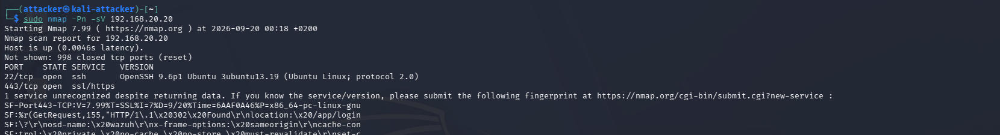

Sur le segment LAN, le scan de decouverte par ping n'a trouve que la passerelle pfSense : PC-Client01 ne repond pas au ping ICMP, son pare-feu Windows bloquant ce type de requete par defaut. La machine reste neanmoins bien detectable via un scan de ports (`-Pn`).

### Detection

Cote reseau, une recherche dans le fichier de logs brut de Suricata (telecharge directement depuis pfSense, l'interface web n'affichant pas clairement l'evenement noye dans le volume d'alertes) confirme 11 alertes generees pendant la fenetre du scan complet sur DC01 (22:23 a 22:26 UTC), toutes avec `192.168.40.10` (Kali) comme source et `192.168.20.10` (DC01) comme destination.

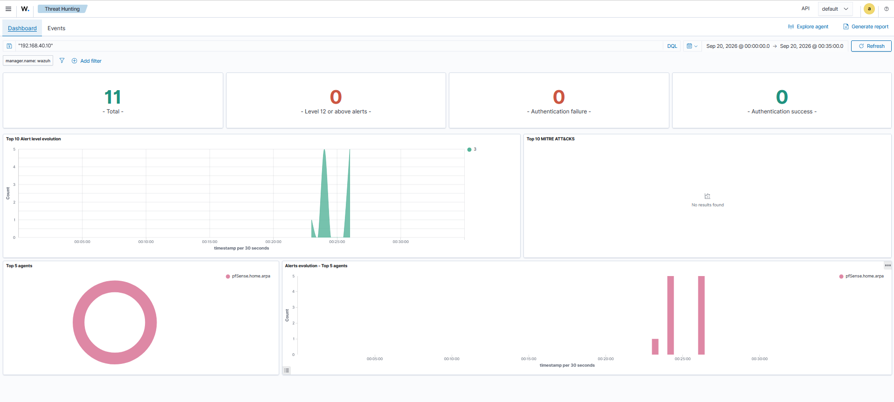

Le detail de ces alertes montre deux types de signatures declenchees par le comportement agressif de sondage de Nmap : `SURICATA Applayer Mismatch protocol both directions` (sur les ports RPC dynamiques, pendant la phase de detection de version) et `SURICATA SMB malformed request dialects` (pendant l'enumeration SMB par les scripts NSE).

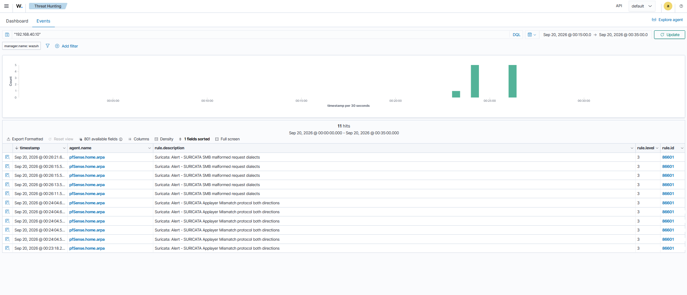

### Constat

Un scan Nmap agressif (avec detection de version et scripts) genere des anomalies protocolaires suffisantes pour etre detectees par Suricata, meme sans regle de detection de scan dediee (categorie `emerging-scan.rules`, non activee dans cette configuration). Un scan plus discret (simple ping scan ou scan de connexion basique) ne genererait probablement aucune alerte avec le ruleset ETOpen par defaut.

## Scenario 2 - Attaque par force brute (NetExec)

### Objectif

Simuler une attaque par dictionnaire sur un compte de domaine (`jean.dupont`) via le protocole SMB, et verifier si l'Active Directory dispose d'une protection contre ce type d'attaque (verrouillage de compte), puis verifier la detection cote reseau et cote hote.

### Deroulement de l'attaque

Une wordlist de dix mots de passe courants a ete constituee et utilisee avec `netexec` contre DC01. Les dix tentatives ont echoue (mot de passe reel non present dans la liste), et le compte ne s'est jamais verrouille.

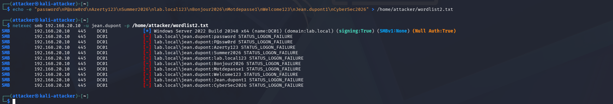

### Detection

Cote reseau, la recherche dans les logs Suricata sur la fenetre de l'attaque (23:35 a 23:38 UTC) n'a revele aucune alerte, quelle que soit l'adresse IP consideree. Ce resultat s'explique par le fait qu'un brute force SMB genere du trafic syntaxiquement valide (de vraies requetes d'authentification, seulement avec de mauvais mots de passe), ce qui ne correspond a aucune signature du ruleset ETOpen par defaut.

Cote hote, la detection Wazuh est en revanche complete et efficace :

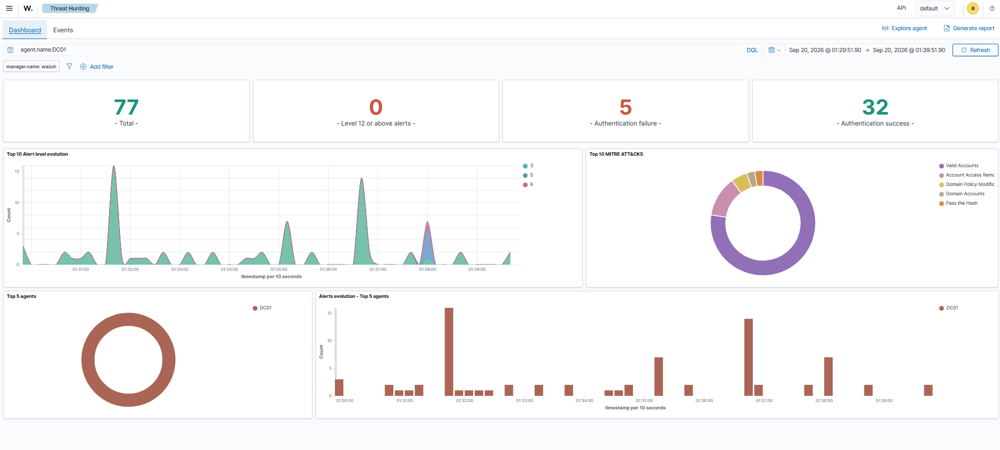

Le detail des evenements montre cinq alertes `Logon Failure - Unknown user or bad password` (une par tentative echouee), ainsi qu'une alerte de niveau 6 `Successful Remote Logon Detected - User:\ANONYMOUS LOGON - NTLM authentication, possible pass-the-hash attack`, correspondant a la phase d'enumeration anonyme effectuee par netexec avant l'attaque.

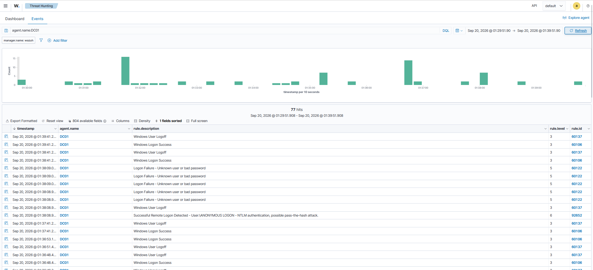

### Constat

Deux enseignements principaux :

- Absence de politique de verrouillage de compte sur l'Active Directory du lab : dix tentatives successives n'ont entraine aucun verrouillage. C'est une vulnerabilite a corriger (voir recommandations).
- Bon exemple de defense en profondeur : la detection reseau (Suricata) a totalement rate ce scenario, alors que la detection basee sur les logs hote (Wazuh) l'a detecte sans probleme. Cela illustre l'interet de disposer de plusieurs couches de detection complementaires.

## Scenario 3 - Mouvement lateral

### Objectif

Comparer le comportement et le niveau de detection obtenus selon que l'attaquant dispose d'un compte de domaine standard ou d'un compte Administrateur du domaine, dans une logique de post-exploitation apres obtention d'identifiants valides.

### Test avec un compte standard (jean.dupont)

L'authentification avec le compte `jean.dupont` reussit, mais l'enumeration des partages montre que les partages administratifs (`ADMIN$`, `C$`) ne sont pas accessibles, contrairement aux partages `IPC$`, `NETLOGON` et `SYSVOL` (accessibles en lecture). Aucune commande n'a pu etre executee a distance avec ce compte, comportement attendu et securise pour un compte utilisateur standard.

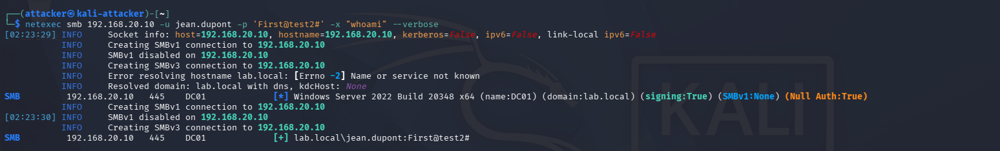

### Test avec le compte Administrateur du domaine

Avec le compte Administrateur du domaine, netexec confirme une compromission totale (indicateur `Pwn3d!`). L'execution de commandes a distance a fonctionne via la technique `wmiexec` (`whoami`, `whoami /priv`), et l'extraction des hashs SAM locaux a egalement reussi (trois comptes locaux extraits : Administrateur, Invite, DefaultAccount).

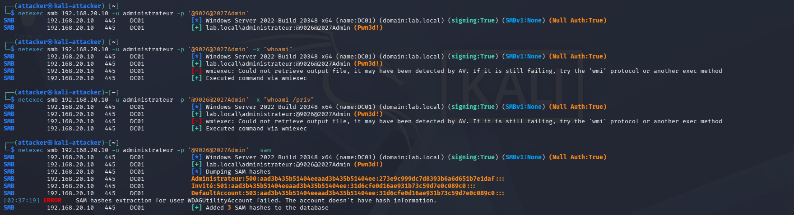

A noter : un message d'avertissement (`Could not retrieve output file, it may have been detected by AV`) suggere qu'une protection antivirus a partiellement reagi au mecanisme de recuperation du resultat de la commande, meme si l'execution elle-meme n'a pas ete bloquee.

### Detection

La comparaison avec le compte Administrateur declenche une detection Wazuh nettement plus marquee que le test avec le compte standard, avec plusieurs pics d'alertes correspondant a chacune des commandes executees.

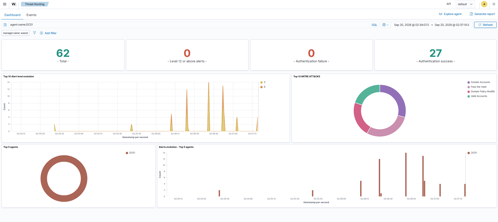

Le detail des evenements montre, pour chaque commande executee via netexec, une alerte de niveau 6 `Successful Remote Logon Detected - User:\Administrateur - NTLM authentication, possible pass-the-hash attack`, systematiquement accompagnee d'une alerte `Special privileges assigned to new logon`, confirmant que Wazuh identifie correctement l'utilisation d'un compte a privileges eleves.

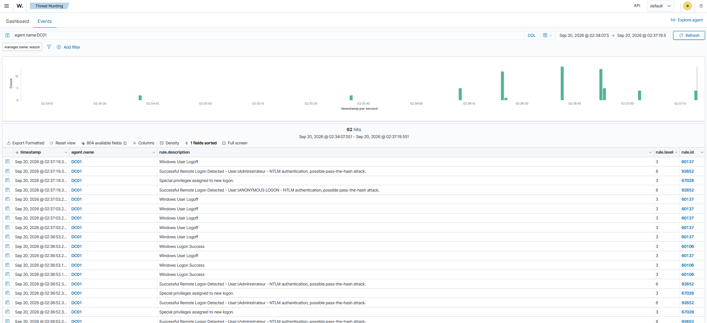

### Cas particulier : PC-Client01 non exploitable depuis Kali

Contrairement a DC01, PC-Client01 s'est revele injoignable en SMB depuis Kali (port 445 filtre), alors meme que le port 135 restait ouvert et que la machine repondait normalement a un ping depuis son propre segment.

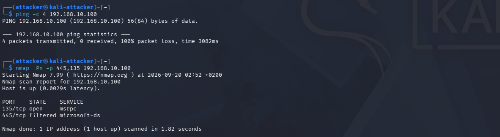

L'explication tient a la portee par defaut de la regle de pare-feu Windows "Partage de fichiers et d'imprimantes (SMB-In)" dans le profil Domaine, qui n'autorise SMB entrant que depuis le sous-reseau local de la machine. Kali se trouvant sur un sous-reseau different (ATTACKER, 192.168.40.0/24), le trafic SMB est bloque des le pare-feu local de PC-Client01, avant meme d'atteindre l'application. C'est un comportement de securite par defaut de Windows qui limite efficacement la surface d'attaque des postes clients, contrairement a un controleur de domaine qui doit rester accessible depuis tous les segments pour fonctionner.

### Constat

Cette comparaison illustre concretement le principe du moindre privilege : un compte standard compromis n'apporte quasiment aucune capacite d'action a un attaquant, alors qu'un compte administrateur compromis permet une prise de controle totale du controleur de domaine. Elle montre egalement l'interet, au niveau architecture, de la segmentation par sous-reseau combinee a la portee par defaut des regles de pare-feu Windows, qui protege les postes clients d'un acces SMB direct depuis un segment externe.

## Scenario 4 - Exfiltration de donnees

### Objectif

Simuler le vol d'un fichier sensible depuis DC01 vers la machine attaquante, en s'appuyant sur l'acces administrateur deja obtenu au scenario precedent, puis verifier la detection de cette action.

### Deroulement de l'attaque

Un fichier factice (`confidentiel.txt`, contenant un texte simulant des donnees RH confidentielles) a ete cree directement sur DC01. Ce fichier a ensuite ete recupere depuis Kali via `netexec`, en utilisant la fonction de telechargement de fichier par SMB (`--get-file`) avec le compte Administrateur. Le contenu du fichier recupere sur Kali a ete verifie et correspond exactement a l'original.

### Detection

Aucune capture d'ecran specifique n'a ete realisee pour ce scenario ; les elements de detection ci-dessous sont issus directement de la consultation du tableau de bord Wazuh au moment des faits.

La connexion SMB utilisee pour le transfert de fichier a genere une nouvelle occurrence de l'alerte deja rencontree au scenario 3 (`Successful Remote Logon Detected...NTLM authentication, possible pass-the-hash attack`, niveau 6, regle 92652).

Une alerte plus significative est apparue quelques instants avant le transfert : `Executable file dropped in folder commonly used by malware` (regle 92213, niveau 15, l'un des niveaux de criticite les plus eleves du ruleset Wazuh). Cette alerte est tres probablement liee aux fichiers temporaires deposes sur DC01 par la technique `wmiexec` lors des executions de commandes du scenario 3, Wazuh ayant correctement identifie ce depot de fichier comme caracteristique d'un outil de post-exploitation.

### Constat

Meme sans capture d'ecran dediee a ce scenario, la correlation avec les alertes deja collectees suffit a demontrer que l'exfiltration, realisee dans la continuite d'une compromission deja detectee, n'echappe pas au systeme de detection : l'alerte critique de niveau 15 constitue en soi une preuve de detection tres solide et directement exploitable.

## Synthese de la Phase 4

| Scenario | Attaque | Detection reseau (Suricata) | Detection hote (Wazuh) | Constat principal |
|---|---|---|---|---|
| 1. Reconnaissance | Scan Nmap (decouverte + ports + versions) sur DC01 et PC-Client01 | Oui - 11 alertes (anomalies protocolaires) | Non recherche specifiquement (detection reseau suffisante) | Un scan agressif reste detectable sans regle de scan dediee |
| 2. Force brute | 10 tentatives SMB sur jean.dupont via netexec | Non - aucune alerte | Oui - Logon Failure x5 + pass-the-hash niveau 6 | Absence de politique de verrouillage de compte AD |
| 3. Mouvement lateral | Comparaison compte standard / compte Administrateur | Non recherche specifiquement | Oui - alertes systematiques sur le compte Administrateur, aucune sur le compte standard (aucune action possible) | Principe du moindre privilege bien respecte ; PC-Client01 protege par la portee locale du pare-feu SMB |
| 4. Exfiltration | Copie d'un fichier sensible depuis DC01 via SMB | Non recherche specifiquement | Oui - alerte critique niveau 15 (depot de fichier type malware) | La correlation avec les alertes precedentes suffit a detecter l'exfiltration |

## Recommandations issues de la Phase 4

- Activer la categorie de regles `emerging-scan.rules` sur Suricata afin de detecter egalement les scans de reconnaissance discrets (simple ping scan ou scan de connexion), non couverts par le scenario 1 dans la configuration actuelle.
- Mettre en place une politique de verrouillage de compte sur l'Active Directory (par exemple : verrouillage apres 5 tentatives echouees sur une fenetre de 30 minutes), afin de limiter l'efficacite d'une attaque par force brute, mise en evidence par le scenario 2.
- Limiter strictement le nombre de comptes disposant de droits d'administration sur le controleur de domaine, le scenario 3 ayant demontre l'ecart de risque considerable entre un compte standard et un compte administrateur compromis.
- Envisager une regle de correlation Wazuh dediee au comportement observe au scenario 4 (alerte niveau 15 immediatement suivie d'une connexion administrateur), afin de transformer cette detection en alerte prioritaire explicite plutot qu'en une simple co-occurrence a interpreter manuellement.
